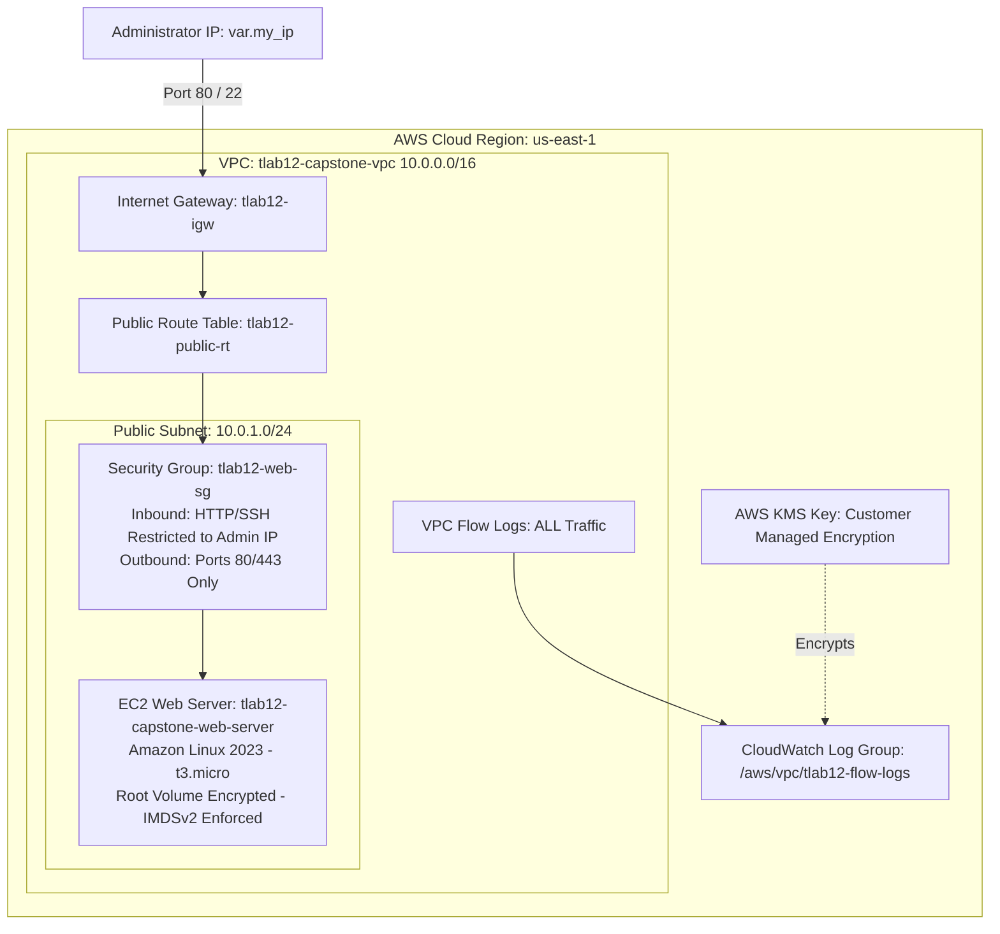

# 🛡️ Secure Automated Web Architecture — TKH Final Capstone


---

## 📌 Project Overview
This project implements a secure, automated web architecture using **Terraform**, **AWS**, and **GitHub Actions**. It strictly follows the TKH Capstone Milestones: provisioning foundational infrastructure, enforcing an automated DevSecOps quality gate, and deploying an enterprise-hardened web server. 

The resulting environment reflects production-grade cloud standards, featuring strong network isolation, customer-managed KMS encrypted logging, restricted administrative ingress/egress, and continuous security scanning.

---

## 🏗️ Visual Architecture Diagram



---

## 🚀 Milestone Breakdowns

### 📍 Milestone 1 — Infrastructure
* **Phase 1: Workspace Initialization**
  * Created GitHub repository: `TKH-Final-Capstone`
  * Configured local workspace in VS Code with `main.tf` and `variables.tf`.
* **Phase 2: Architecture Build**
  * **Network:** `aws_vpc` (10.0.0.0/16), `aws_subnet` (10.0.1.0/24), Internet Gateway, and Route Table mappings.
  * **Firewall:** `aws_security_group` enforcing restricted HTTP (80) and SSH (22) to administrator IP, with scoped outbound package repository access.
  * **Server:** `aws_instance` (Amazon Linux 2023, `t3.micro`) bootstrapped via `user_data` to auto-provision Apache (`httpd`).
  * **Logging & Encryption Enhancements:** Added customer-managed `aws_kms_key`, CloudWatch log streams, IAM assume roles, and VPC Flow Logs capturing all network traffic.
* **Phase 3: Submission Validation**
  * Successfully initialized (`terraform init`) and validated syntax (`terraform validate`).

---

### 📍 Milestone 2 — DevSecOps Pipeline
* **Phase 1: SAST Workflow Creation**
  * Configured `.github/workflows/security-scan.yml` integrating `aquasecurity/tfsec-pr-commenter-action`.
  * Enforced `--soft-fail=false` as a hard quality gate blocking misconfigured code pushes.
* **Phase 2: Quality Gate Enforcement**
  * Automated pipeline execution on every push to `main`.
  * Remediated security findings (enforcing IMDSv2, EBS encryption, and KMS logging) to achieve 100% green status pass.

```
[GitHub Push] ➔ [GitHub Actions Trigger] ➔ [tfsec Static Analysis] ➔ [GREEN: 0 Vulnerabilities]
```

---

### 📍 Milestone 3 — Deployment & Verification
* **Phase 1: Launch & Verification**
  * Authenticated via AWS CLI and executed `terraform apply -auto-approve`.
  * Verified live public IPv4 output and loaded custom Apache landing page.
* **Phase 2: Live Verification Screenshot**

*(Insert your captured web page screenshot below)*
> 

---

## 🛠️ Technologies Used

| Technology | Purpose |
| :--- | :--- |
| **AWS** | Cloud Infrastructure Hosting (VPC, EC2, KMS, CloudWatch, IAM) |
| **Terraform** | Infrastructure as Code (IaC) Provisioning & State Management |
| **GitHub Actions** | Continuous Integration & Automated CI/CD Pipelines |
| **tfsec** | Static Application Security Testing (SAST) Quality Gate |
| **Apache (httpd)** | Web Server Execution |

---

## 🔒 Security & Hardening Controls Summary

* **Network Perimeter:** Strict Security Group ingress limited solely to `var.my_ip`. Outbound traffic strictly limited to Ports 80 and 443.
* **Compute Security:** Enforced Instance Metadata Service Version 2 (`IMDSv2`) to mitigate SSRF token abuse; EBS root volume encrypted at rest.
* **Audit & Forensics:** VPC Flow Logs continuously record network interface traffic into a CloudWatch Log Group encrypted with an AWS KMS Customer Managed Key.

---

## 📋 Deployment Instructions

1. **Initialize Workspace:**
   ```bash
   terraform init
   ```
2. **Validate Syntax:**
   ```bash
   terraform validate
   ```
3. **Review Execution Plan:**
   ```bash
   terraform plan
   ```
4. **Deploy Infrastructure:**
   ```bash
   terraform apply -auto-approve
   ```
5. **Teardown Infrastructure:**
   ```bash
   terraform destroy -auto-approve
   ```

---

## 🔚 Conclusion
This capstone demonstrates end-to-end technical competency across Terraform, AWS cloud architecture, DevSecOps pipeline automation, and zero-trust security controls—reflecting real-world production standards and readiness for professional cloud engineering roles.

---

## 👤 Author
* **Portfolio/GitHub:** [jeman28-lgtm](https://github.com/jeman28-lgtm)
* **Track:** Cloud Security Engineering